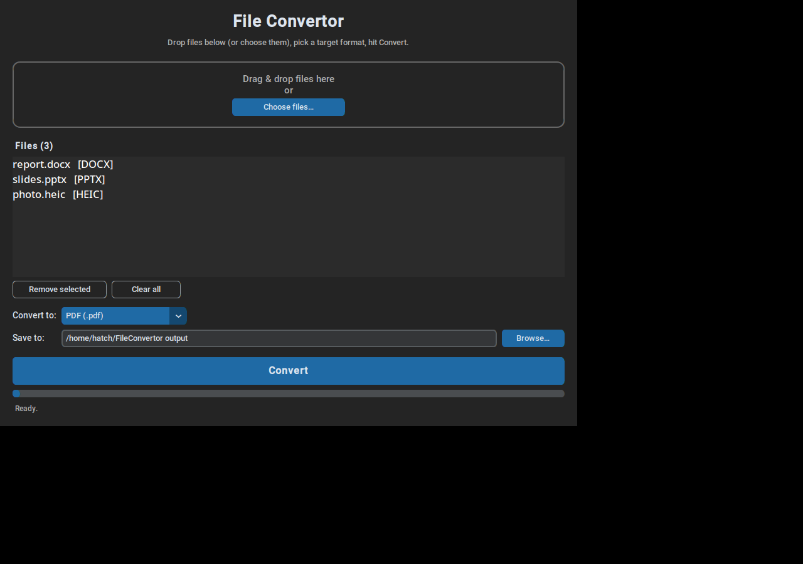

# File Convertor

A drag-and-drop desktop app (Python) that converts files between
**PDF, DOCX, PPTX, PNG, JPEG, and HEIC**.



## How it works

1. Drag & drop files onto the window (or click **Choose files…**).
2. Pick the target format from the dropdown.
3. Choose where to save (defaults to `~/FileConvertor output`).
4. Hit **Convert**. Each file becomes a new file of the target type.

Multi-page PDFs convert to one image per page (`name_p1.png`, `name_p2.png`, …);
images convert into one-slide-per-image PowerPoints, one-image-per-page Word
docs, or multi-page PDFs.

## Run it

```bash
python3 -m venv .venv
.venv/bin/pip install -r requirements.txt
./run.sh        # or: .venv/bin/python app.py
```

## Conversion notes

- **Images ↔ images** (PNG/JPEG/HEIC) use Pillow (+ pillow-heif for HEIC).
- **PDF → images** renders each page at 200 DPI via PyMuPDF.
- **Images → PDF/DOCX/PPTX** are built directly (no extra software needed).
- **Anything involving DOCX/PPTX as office documents** (e.g. DOCX → PDF,
  PPTX → DOCX, DOCX → PNG) uses LibreOffice in headless mode — install
  LibreOffice if those conversions report it missing.
- Converting a file to its own type just makes a copy.

## Project layout

- `app.py` — the GUI (customtkinter + tkinterdnd2 drag & drop)
- `converter.py` — the conversion engine (usable on its own)
- `requirements.txt`, `run.sh`
